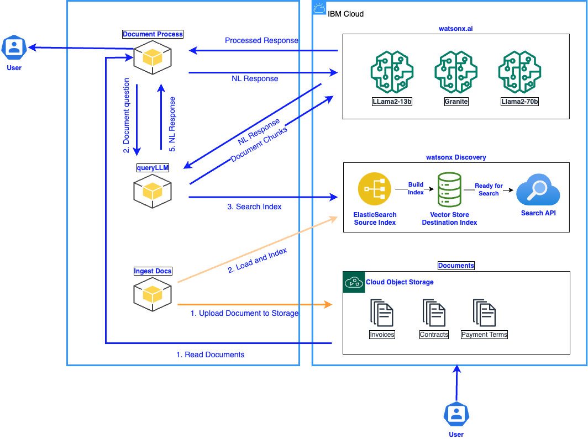

<!-- ABOUT THE PROJECT -->

# RAG Document Processing

This RAG Document Processing tool is used to ingest documents into watsonx Discovery and query these documents. This repository provides two tools: the RAG-LLM-Service API and the Document-Processing script.

The RAG-LLM-Service API can be used to ingest files from IBM Cloud Object storage into watsonx Discovery (ingestDocs endpoint) and do RAG on a file (queryLLM endpoint).

The Document-Processing script can be used to perform RAG across all files in a IBM Cloud Object Storage bucket. Additionally, the "answer_processing_instructions.txt" file can be modified to further process the retrieved answers.

## Architecture Diagram



<!-- GETTING STARTED -->

## Getting Started

### Prerequisites

The following prerequisites are required to interface with watsonx Discovery and run the document processing script:

1. Python3
2. IBM Cloud api key
   1. This must be for the same cloud account that hosts your Cloud Object Storage, watsonx.ai, and watsonx Discovery instances
3. watsonx.ai project id
   1. This can be found in Watson Studio -> select your project -> Manage
4. IBM Cloud Object Storage endpoint url, resource instance ID, and bucket name
   1. Your endpoint url can be found by selecting your Cloud Object Storage resource within IBM Cloud -> select your bucket -> Configuration -> scroll to the "public endpoint"
   2. Your instance id can be generated by selecting your Cloud Object Storage resource within IBM Cloud -> Service Credentials -> New Credential -> Role: Content Reader
5. watsonx Discovery username, password, and url
6. watsonx Discovery index name and pipeline name
   1. These are created as a part of your IngestDocs API call

### Installation

#### Start the RAG-LLM-Service

1. Clone the repo

   ```bash
   git clone git@github.com:ibm-ecosystem-engineering/RAG-Document-Processing.git
   ```

2. Change directory into RAG-Document-Processing

   ```bash
   cd RAG-Document-Processing
   ```

3. Create a python virtual environment

   ```bash
   python3 -m venv virtual-env
   source virtual-env/bin/activate
   pip3 install -r requirements.txt
   ```

4. Copy env file to .env

   ```bash
   cp env .env
   ```

5. Configure parameters in .env based on your prerequisites

6. Change directory in RAG-LLM-Service and spin up the API

   ```bash
   cd RAG-LLM-Service
   python3 app.py
   ```

   1. To access Swagger: <http://0.0.0.0:4050/docs>

#### Run batch Document-Processing

1. Open a new terminal, change directory into the cloned repo, start the virtual environment, and change directories into Dcoument-Processing

   ```bash
    cd RAG-Document-Processing
    source virtual-env/bin/activate
    cd Document-Processing
   ```

2. Configure config files within the config directory
   1. You can modify doc_processing_config.json to
      1. Choose what questions to process across documents
      2. Only process specific documents
      3. Only process newly added (unprocessed) documents
   2. You can modify answer_processing_instructions.txt to specify what you want to extract from the watsonx Discovery answer chunks
3. Run batch Document-Processing

   ```bash
   python3 document_processing_script.py
   ```

4. When you are done with the tools, run the following command to exit the python virtual environment:

   ```bash
   deactivate
   ```
